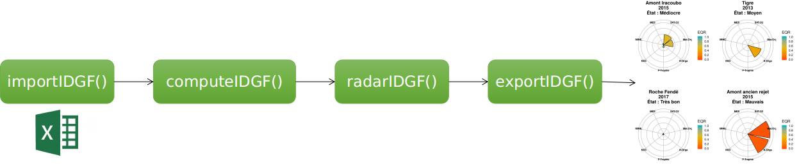
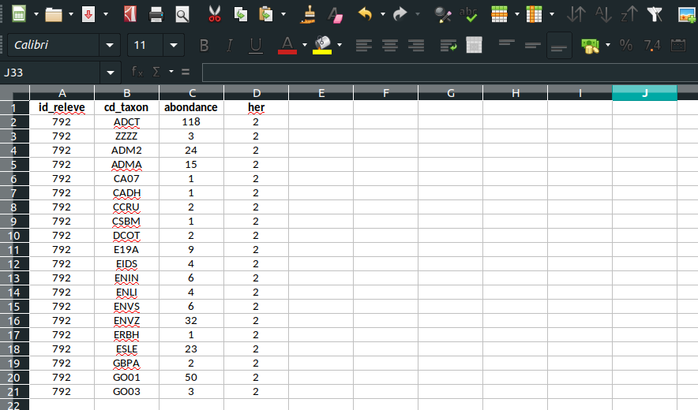
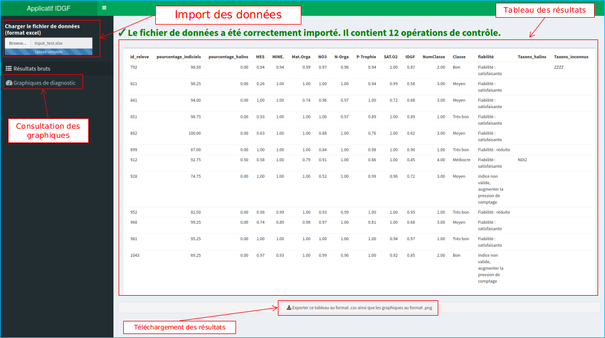

<!-- README.md is generated from README.Rmd. Please edit that file -->

```{r setup, include = FALSE, message=FALSE,warning=FALSE}
knitr::opts_chunk$set(
  collapse = TRUE,
  comment = "#>",
  fig.path = "man/figures/README-"
)
```
# Applicatif simplifié de calcul R pour l'IDGF

```{r options, include = FALSE}
knitr::opts_chunk$set(
  collapse = TRUE,
  comment = "#>"
)
```

```{r setup package, echo = FALSE}
library(IDGF)
```

# Préambule

La Directive Cadre sur l’Eau (DCE) impose aux états membres de l’Union Européenne un suivi de la qualité écologique de leurs masses d’eau via l’étude de compartiments biologiques clés du milieu aquatique. La Guyane Française est un Département d’Outre-Mer (DOM) situé dans la partie Amazonienne de l’Amérique du sud. Ce département, malgré son éloignement, est un territoire européen comme tous les autres DOM et est donc soumis aux prescriptions de la DCE. Les travaux de la dernière décennie, notamment sur le compartiment diatomique, ont mené à l’élaboration de plusieurs nouveaux indices biologiques spécifiquement adaptés aux conditions biogéographiques (substrats géologiques, climat, faune et flore locale) de chacun de ces territoires ultramarins. 

Cependant, la conception d’un indice diatomique spécifique à la Guyane a connu une progression plus lente, du fait des conditions naturelles particulières qui mènent à des cortèges diatomiques très spécifiques et encore fortement méconnus. En l’absence d’un dispositif plus adapté, un système réglementaire d’évaluation basé sur une adaptation locale de l’IPS a été mis en place pour mesurer l’État Écologique des cours d’eau de Guyane (cf. Arrêté Évaluation du 27 Juillet 2015), malgré des faiblesses évidentes liées au décalage biogéographique du profil de beaucoup de taxons de l’IPS, établis à partir de données mondiales. Cependant, l’augmentation progressive des référentiels capitalisés dans le cadre des réseaux de suivi Guyanais sur ces 9 dernières années, ainsi que les progrès réalisés sur la taxonomie, ont rendu possible la réalisation de la présente étude 2017-2018 visant à l’élaboration d’un nouvel Indice Diatomique pour la Guyane Française (IDGF). 

En tirant les enseignements adéquats des précédents indices diatomiques élaborés dans d’autres DOM-COM, une méthodologie adaptée au contexte Guyanais a été développée en se basant (i) sur une réduction du nombre de taxons pris en compte dans les assemblages et (ii) sur la recherche de taxons d’alerte dans une optique multimétrique. Cette approche a permis la conception d’un indice qui présente une évaluation écologique compatible avec les préconisations de la DCE (notion d’écart à une référence régionale) et donne des résultats pertinents, selon l’avis des experts locaux, et cohérents par rapport au contexte naturel et aux activités anthropiques rencontrés en Guyane. 

La présente notice d'utilisation accompagne le package R `IDGF` qui a été développé lors de ce travail et permet de l'utiliser correctement pour calculer une note d'IDGF, la classe de qualité écologique qui en découle ainsi que de produire un diagramme d'appui au diagnostic de l'état écologique des masses d'eau continentales Guyanaises.

# Pré-requis

## Installation de R / Rstudio

L'applicatif de calcul IDGF a été développé en langage R et nécessite donc l'installation de ce programme pour son exécution.

Ce tutoriel liste les principales étapes à suivre pour installer R facilement (Vous pouvez ignorer les notes préliminaires sur les outils supplémentaires à installer) : 

[https://stt4230.rbind.io/introduction/installation_r_rstudio](https://stt4230.rbind.io/introduction/installation_r_rstudio)

Il est vivement conseillé d'installer Rstudio à la suite de R (toujours en suivant ce tutoriel). Rstudio est une interface graphique permettant d'exécuter des programmes R de façon plus conviviale que via la console R classique. 

**Important** : Pour les utilisateurs Windows, il est important de suivre la procédure de ce tutoriel pour installer RTools. En effet, la majorité des packages récemment développés sous R (tels que le package IDGF) s'appuient sur des librairies (modules externes) qui nécessitent l'installation du programme Rtools.

## Prise en main de R

Si vous découvrez R, alors nous vous conseillons la lecture du chapitre suivant :

[https://stt4230.rbind.io/introduction/base_r/](https://stt4230.rbind.io/introduction/base_r/)

# Installation du package IDGF

## Depuis l'espace Hydrobio-DCE (version "stable")

Cet applicatif accompagné de sa notice utilisateur sont disponibles au téléchargement sur le site Hydrobio-DCE : [https://hydrobio-dce.inrae.fr/](https://hydrobio-dce.inrae.fr/).

Dans l'archive (.zip) téléchargée depuis cet espace, se trouvent la présente notice, un fichier de projet Rstudio `.Rproj` ainsi qu'une archive au format `.tar.gz`. Cette archive est un package R contenant les fonctions nécessaires pour la réalisation de l'IDGF. Après avoir extrait cette archive sur votre ordinateur, vous pouvez ouvrir le fichier de projet `.Rproj`, ce qui ouvrira directement Rstudio correctement configuré en termes de chemin d'accès.

Pour installer le package IDGF ainsi que ses dépendences associées, vous pouvez exécuter dans la console :

```{r installation local, eval=FALSE}
remotes::install_local("IDGF_2.0.tar.gz")
```

Ceci devrait installer le package ainsi que ses dépendances. Cette opération peut être chronophage si vous n'avez jamais installé de packages R auparavant.

**En cas d'erreur, merci de vérifier que RTools est bien installé**

Si l'installation s'est bien passée, alors la commande suivante devrait fonctionner :

```{r exemple library}
library(IDGF)
```

## Depuis la forge logicielle GitHub (version "développeur")

La version en cours de développement du package R est également hébergée sur github :

[https://github.com/davidcarayon/IDGF](https://github.com/davidcarayon/IDGF)

Il est donc possible d'installer le package par la fonction suivante :

```{r installation github, eval = FALSE}
remotes::install_github("davidcarayon/IDGF")
```

Ici encore si l'installation s'est bien passée, alors la commande suivante devrait fonctionner :

```{r exemple library2}
library(IDGF)
```

# Présentation de l'applicatif

## Modules et fonctionnalités

Le package R IDGF est constitué de 4 modules interconnectés :

- `importIDGF()` : Importe les données dans R à partir d'un fichier de données (type excel), puis applique quelques transformations telles que des transcodages de synonymes.

- `computeIDGF()` : Calcule, à partir des données importées via la fonction précédente, les différentes métriques de l'IDGF en se basant sur des tableaux internes listant le statut de chaque taxon (alerte, halin, etc.) ainsi que les valeurs de référence pour chaque HER.

- `radarIDGF()` : Module facultatif qui produit des diagrammes radar d'appui au diagnostic à partir des résultats de la fonction précédente

- `exportIDGF()` : Exporte les résultats de l'IDGF (score des métriques individuelles, évaluation de l'état écologique) au format .csv et les diagrammes de diagnostic au format .png (si la fonction de radar a été utilisée) dans le répertoire de travail.





## Données internes embarquées

L'outil de calcul IDGF fait appel à différentes tables de références qui ont été constituées lors de la création de l'indice et qui sont stockées dans un fichier interne au package. Ces tables de référence sont au nombre de 3 :

1. `transcode` : Table de transcodage permettant de faire correspondre un code taxon 4-lettres (type OMNIDIA) à son entité taxonomique qui a été considérée pour la construction de l'IDGF.

2. `table_metrics` : Table contenant une information binaire pour chaque taxon et donnant une indication sur si le taxon considéré est halin, indiciel, ou taxon d'alerte d'un ou plusieurs paramètres d'anthropisation (et si oui, desquels). Les informations de cette table sont utilisée pour définir le statut du taxon (indiciel, non indiciel, halin ou inconnu) et est combinée aux listes floristiques insérées dans l'algorithme par multiplication.

3. `table_ref` : Table contenant les valeurs de référence pour chaque paramètre *composite* d'anthropisation selon l'hydroécorégion considérée (1 pour la plaine littorale, 2 pour le bouclier Guyanais)

# Préparation des données

Actuellement, l’IDGF n’accepte qu’un format d’entrée correspondant scrupuleusement à cette configuration en 4 colonnes:



## Description des champs

- id_releve 
  - Description : Correspond à l'identifiant unique du relevé diatomique. 
  - Format : Chaîne de caractères ou nombre entier
  - Exemple : "A" ou 10

- cd_taxon
  - Description : Code OMNIDIA du taxon
  - Format : Chaîne de 4 caractères 
  - Exemple : "ADCT" ou "CA07"

- abondance
  - Description : Nombre de valves comptées
  - Format : Entier positif

- her
  - Numéro de l'HER. 1 pour la Plaine Littorale et 2 pour le Bouclier Guyanais
  - Format : Entier positif, soit 1 soit 2

## Sauvegarde et format
Ce fichier peut être sauvegardé sous différents formats :

- Fichier Microsoft Excel 2003-2007 : .xls
- Fichier Microsoft Excel plus récents : .xlsx
- Fichier texte plat au format .csv : **Attention aux paramètres : séparateurs en point-virgule et décimale en point**

Veillez à bien placer votre fichier de données dans votre répertoire de travail (pour le vérifier, taper `getwd()`et pour le modifier, aller dans Session > Définir le répertoire courant).

# Utilisation de l'applicatif

## Via une interface interactive

Afin de simplifier l'utilisation de cet applicatif, une version interactive a également été développée. Pour l'utiliser, il suffit d'exécuter cette commande :

```{r appplication, eval = FALSE}
library(IDGF) # On vérifie que le package est bien chargé
runIDGFTool() # Va lancer un applicatif
```

Un pop-up va alors s'ouvrir comme une seconde page de Rstudio. Il est conseillé d'élargir cette fenêtre en plein écran.



A partir de cette interface, il suffit de charger les données à l'aide du bouton de chargement, puis il sera possible de visionner à partir des modules de la barre latérale :

- Les résultats bruts (sous forme de tableau) 
- Les diagrammes de diagnostic (Note : L'affichage des graphiques peut nécessiter quelques secondes)

Enfin, il est possible de télécharger l'ensemble de ces résultats sous forme d'archive compressée.

## Via lignes de code

Le script R "script_calcul_IDGF.R" présent dans l'archive téléchargeable depuis hydrobioDCE (cf. 3.1) contient l'ensemble des lignes de commandes à éxecuter pour réaliser l'IDGF. Si vous ne disposez pas de ce fichier, les lignes suivantes vous permettrons d'utiliser l'applicatif.

```{r calcul IDGF, eval = FALSE}
library(IDGF) # Veiller à exécuter cette commande au moins une fois avant de lancer le script

# Vérifier le répertoire de travail (où R va chercher les données puis exporter les résultats)
getwd()

# Définir le nom du fichier de données, par exemple : "test_fichier.xlsx"
# /!\ A MODIFIER /!\ puis le reste peut être exécuté d'un bloc
nom_fichier <- "a_remplacer"

# Import des données
IDGFdata <- importIDGF(nom_fichier)

# Calcul de l'IDGF
IDGFres <- computeIDGF(IDGFdata)

# Production des diagrammes d'appui au diagnostic
IDGFresrad <- radarIDGF(IDGFres)

# Export des données et graphiques dans un dossier appelé 'sorties' (modifiable)
exportIDGF(IDGFresrad, outdir = "sorties")

## Fin de l'algorithme
```

# Compréhension des résultats

Le tableau des résultats présente les champs suivants :

- id_releve : Le nom donné au relevé diatomique
- pourcentage_indiciel : Pourcentage de taxons de l'assemblage qui figurent dans la liste des taxons indiciels
- pourcentage_halins : Pourcentage de taxons de l'assemblage qui figurent dans la liste des taxons halins
- MES à SAT.O2 : Valeur de chaque métrique constitutive de l'IDGF
- IDGF : Valeur de l'IDGF
- NumClasse : Numéro correspondant à la classe d'état écologique (1 = Très bon, 5 = Mauvais)
- Classe : Classe d'état écologique
- Fiabilité : Indication de fiabilité basée sur le pourcentage de taxons indiciels présents
- Taxons_halins : Identité des taxons identifiés dans le relevé comme halins, séparés par une virgule
- Taxons_inconnus : Identité des taxons identifiés dans le relevé et ne trouvant pas de correspondance dans le table de transcodage, séparés par une virgule


# A propos

Le package de calcul de l’IDGF est un programme libre; vous pouvez le redistribuer ou le modifier suivant les termes de la GNU General Public License (GPL) telle que publiée par la Free Software Foundation; soit la version 3 de la licence, soit (a votre gré) toute version ultérieure. Ce travail est diffusé dans l’espoir qu’il sera utile, mais sans aucune garantie de qualité marchande ou d’adéquation à un but particulier.

En cas de problèmes rencontrés avec l'outil, contacter : 

- David Carayon [david.carayon@inrae.fr](mailto:david.carayon@inrae.fr)
- François Delmas [francois.delmas@inrae.fr](mailto:francois.delmas@inrae.fr)

# Références 

Carayon, D., Eulin, A., Vigouroux, R. Delmas, F. (submitted). A new multimetric index for the evaluation of water ecological quality of French Guiana streams based on benthic diatoms. Ecological Indicators

David Carayon & François Delmas (2020). IDGF: Indice Diatomique de Guyane Française. R package version 2.0
  
Carayon, D., Eulin, A., Vigouroux, R. Delmas, F. (2019). Evaluation de l’état écologique des cours d’eau de Guyane française : L’Indice Diatomique pour la Guyane Française (IDGF) : Rapport final
