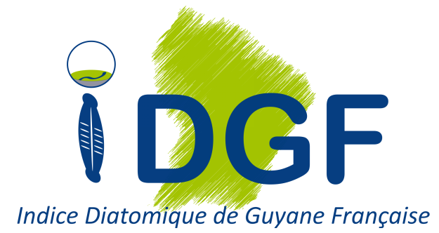

<!-- README.md is generated from README.Rmd. Please edit that file -->

```{r setup, include = FALSE, message=FALSE,warning=FALSE}
knitr::opts_chunk$set(
  collapse = TRUE,
  comment = "#>",
  fig.path = "man/figures/README-"
)
```
# Package R IDGF




```{r message = FALSE, warning=FALSE, echo = FALSE}
# Chargement des packages
library(tidyverse)
library(here)
library(gt)
```

```{r options, include = FALSE}
knitr::opts_chunk$set(
  collapse = TRUE,
  comment = "#>"
)
```

```{r setup package, echo = FALSE}
library(IDGF)
```

# Préambule

La Directive Cadre sur l’Eau (DCE) impose aux états membres de l’Union Européenne un suivi de la qualité écologique de leurs masses d’eau via l’étude de compartiments biologiques clés du milieu aquatique. La Guyane Française est un Département d’Outre-Mer (DOM) situé dans la partie Amazonienne de l’Amérique du sud. Ce département, malgré son éloignement, est un territoire européen comme tous les autres DOM et est donc soumis aux prescriptions de la DCE. Les travaux de la dernière décennie, notamment sur le compartiment diatomique, ont mené à l’élaboration de plusieurs nouveaux indices biologiques spécifiquement adaptés aux conditions biogéographiques (substrats géologiques, climat, faune et flore locale) de chacun de ces territoires ultramarins. 

Cependant, la conception d’un indice diatomique spécifique à la Guyane a connu une progression plus lente, du fait des conditions naturelles particulières qui mènent à des cortèges diatomiques très spécifiques et encore fortement méconnus. En l’absence d’un dispositif plus adapté, un système réglementaire d’évaluation basé sur une adaptation locale de l’IPS a été mis en place pour mesurer l’État Écologique des cours d’eau de Guyane (cf. Arrêté Évaluation du 27 Juillet 2015), malgré des faiblesses évidentes liées au décalage biogéographique du profil de beaucoup de taxons de l’IPS, établis à partir de données mondiales. Cependant, l’augmentation progressive des référentiels capitalisés dans le cadre des réseaux de suivi Guyanais sur ces 9 dernières années, ainsi que les progrès réalisés sur la taxonomie, ont rendu possible la réalisation d'un programme d'étude 2017-2018 visant à l’élaboration d’un nouvel Indice Diatomique pour la Guyane Française (IDGF).

En tirant les enseignements adéquats des précédents indices diatomiques élaborés dans d’autres DOM-COM, une méthodologie adaptée au contexte Guyanais a été développée en se basant (i) sur une réduction du nombre de taxons pris en compte dans les assemblages et (ii) sur la recherche de taxons d’alerte dans une optique multimétrique. Cette approche a permis la conception d’un indice qui présente une évaluation écologique compatible avec les préconisations de la DCE (notion d’écart à une référence régionale) et donne des résultats pertinents, selon l’avis des experts locaux, et cohérents par rapport au contexte naturel et aux activités anthropiques rencontrés en Guyane. 

Le présent dépôt contient le package R `IDGF` qui a été développé lors de ce travail et permet de l'utiliser correctement pour calculer une note d'IDGF, la classe de qualité écologique qui en découle ainsi que de produire un diagramme d'appui au diagnostic de l'état écologique des masses d'eau continentales Guyanaises.

# Installation

```{r installation github, eval = FALSE}
if (!"remotes" %in% rownames(installed.packages())) {install.packages("remotes")}
remotes::install_github("davidcarayon/IDGF")
```

```{r exemple library2}
library(IDGF)
```

# Présentation de l'applicatif

## Modules et fonctionnalités

Le package IDGF est constitué de 4 modules interconnectés :

- `importIDGF()` : Importe les données dans R à partir d'un fichier de données (type excel), puis applique quelques transformations telles que des transcodages de synonymes.

- `computeIDGF()` : Calcule, à partir des données importées via la fonction précédente, les différentes métriques de l'IDGF en se basant sur des tableaux internes listant le statut de chaque taxon (alerte, halin, etc.) ainsi que les valeurs de référence pour chaque HER.

- `radarIDGF()` : Module facultatif qui produit des diagrammes radar d'appui au diagnostic à partir des résultats de la fonction précédente.

- `exportIDGF()` : Exporte les résultats de l'IDGF (score des métriques individuelles, évaluation de l'état écologique) au format .csv et les diagrammes de diagnostic au format .png (si la fonction de radar a été utilisée).


## Données internes embarquées 

L'outil de calcul IDGF fait appel à différentes tables de référence qui ont été construites lors de la création de l'indice et qui sont stockées dans un fichier interne au package. Ces tables de référence sont au nombre de 3 :

**`transcode`** : Table de transcodage permettant de faire correspondre un code taxon 4-lettres (type OMNIDIA) à son entité taxonomique qui a été considérée pour la construction de l'IDGF. Cette table recence les 2022 codes taxon possibles identifiés jusqu'à maintenant en Guyane et va donner pour chacun de ces codes sa correspondance à un code accepté pour le calcul (notamment dans le cas de synonymes ou d'évolution des connaissances taxonomiques). Dans l'extrait ci-dessous, la colonne 'v1' correspond au code utilisé par l'indice pour sa première version finalisée tandis que la colonne v2 ménage la possibilité technique d'utilisation de cet outil d'une future version de l'indice.

```{r echo = FALSE}
load("R/sysdata.rda")

head(transcode) %>% mutate(nom_taxon = ifelse(nom_taxon == "Hantzschia amphyoxis", yes = "Hantzschia amphioxys", no = nom_taxon))
```


**`table_metrics`** : Table contenant une information binaire pour chaque taxon et donnant une indication sur si le taxon considéré est halin, indiciel (utilisé pour l'indice), ou taxon d'alerte d'un ou plusieurs paramètres d'anthropisation (et si oui, desquels). Ci-dessous un extrait :

```{r echo = FALSE}
table_metrics[60:64,]
```

**`table_ref`** : Table contenant les valeurs de référence pour chaque paramètre *composite* d'anthropisation selon l'hydroécorégion considérée (1 pour la plaine littorale, 2 pour le bouclier Guyanais). Ci-dessous un extrait :

```{r echo = FALSE}
names(table_ref) <- c("NUM_HER","Param","Ref_value")
head(table_ref)
```

# Préparation des données

Actuellement, l’IDGF n’accepte qu’un format d’entrée correspondant scrupuleusement à cette configuration en 4 colonnes:


## Description des champs

- id_releve 
  - Description : Correspond à l'identifiant unique du relevé diatomique
  - Format : Chaîne de caractères ou nombre entier
  - Exemple : "A" ou 10

- cd_taxon
  - Description : Code OMNIDIA du taxon
  - Format : Chaîne de 4 caractères 
  - Exemple : "ADCT" ou "CA07"

- abondance
  - Description : Nombre de valves comptées
  - Format : Entier positif

- her
  - Numéro de l'HER. 1 pour la Plaine Littorale et 2 pour le Bouclier Guyanais
  - Format : Entier positif, soit 1 soit 2

## Sauvegarde et format
Ce fichier peut être sauvegardé sous différents formats :

- Fichier Microsoft Excel 2003-2007 : .xls
- Fichier Microsoft Excel plus récent : .xlsx
- Fichier texte plat au format .csv : **Attention aux paramètres : séparateurs en point-virgule et décimales en point**

# Utilisation de l'applicatif

## Via une interface interactive

Afin de simplifier l'utilisation de cet applicatif, une version interactive est proposée à l'utilisateur. Il suffit d'exécuter cette commande :

```{r appplication, eval = FALSE}
library(IDGF) # On vérifie que le package soit bien chargé
runIDGFTool() # Va lancer un applicatif
```

Un pop-up va alors s'ouvrir comme une seconde page de Rstudio. Il est conseillé d'élargir cette fenêtre en plein écran.


A partir de cette interface, il suffit de charger les données à l'aide du bouton de chargement, puis il sera possible de visionner à partir des modules de la barre latérale :

- Les résultats bruts (sous forme de tableau) 
- Les diagrammes de diagnostic (Note : L'affichage des graphiques peut nécessiter quelques secondes)

Enfin, il est possible de télécharger l'ensemble de ces résultats sous forme d'archive compressée.

## Via lignes de code

```{r calcul IDGF, eval = FALSE}
library(IDGF) # Veiller à exécuter cette commande au moins une fois avant de lancer le script

## Exécuter ces deux lignes pour choisir (1) le fichier d'entrée puis (2) le dossier de sortie des résultats
nom_fichier <- rstudioapi::selectFile()
dossier_sortie <- rstudioapi::selectDirectory()

## /!\ NOTE : ces fonctions ne marcheront que si vous exécutez ce code depuis Rstudio. Il existe des fonctions alternatives sans Rstudio mais qui ne fonctionnent que sous windows. Vous pouvez vous en servir en retirant le "#" devant chacune des lignes avant de les exécuter :
# nom_fichier <- file.choose() 
# dossier_sortie <- choose.dir()
 
## ------------------------------------------------------------------
 
### A partir d'ici, vous pouvez lancer le code d'un bloc.

# Import des données
IDGFdata <- importIDGF(nom_fichier)

# Calcul de l'IDGF
IDGFres <- computeIDGF(IDGFdata)

# Production des diagrammes d'appui au diagnostic
IDGFresrad <- radarIDGF(IDGFres)

# Export des données et graphiques dans un dossier appelé 'sorties' (modifiable)
exportIDGF(IDGFresrad, outdir = dossier_sortie)

## Fin de l'algorithme
```

# Compréhension des résultats

Le tableau des résultats présente les champs suivants :

- id_releve : Le nom donné au relevé diatomique
- pourcentage_indiciel : Pourcentage de taxons de l'assemblage qui figurent dans la liste des taxons indiciels
- pourcentage_halins : Pourcentage de taxons de l'assemblage qui figurent dans la liste des taxons halins
- MES à SAT.O2 : Valeur de chaque métrique constitutive de l'IDGF
- IDGF : Valeur de l'IDGF
- NumClasse : Numéro correspondant à la classe d'état écologique (1 = Très bon, 5 = Mauvais)
- Classe : Classe d'état écologique
- Fiabilité : Indication de fiabilité basée sur le pourcentage de taxons indiciels présents
- Taxons_halins : Identité des taxons identifiés dans le relevé comme halins, séparés par une virgule
- Taxons_inconnus : Identité des taxons identifiés dans le relevé et ne trouvant pas de correspondance dans la table de transcodage, séparés par une virgule

# A propos

Le package de calcul de l’IDGF est un programme libre; vous pouvez le redistribuer ou le modifier suivant les termes de la GNU General Public License (GPL) telle que publiée par la Free Software Foundation; soit la version 3 de la licence, soit (a votre gré) toute version ultérieure. Cet outil est diffusé dans l’espoir qu’il sera utile, mais sans aucune garantie de qualité marchande. Néanmoins, toute modification est susceptible de modifier le calcul d'Etat Diatomique, qui ne serait plus conforme à la législation en vigueur.

En cas de problèmes rencontrés avec l'outil, contacter : 

- David Carayon [david.carayon@inrae.fr](mailto:david.carayon@inrae.fr)
- Sébastien Boutry [sebastien.boutry@inrae.fr](mailto:sebastien.boutry@inrae.fr)
- François Delmas [francois.delmas@inrae.fr](mailto:francois.delmas@inrae.fr)

## Perspectives de développement

Dans l'éventualité ou ces travaux seraient repris, suite à l'expression d'un besoin spécifique par les services gestionnaires, il est envisagé d'approfondir la dimension interactive du diagnostic en proposant une sortie détaillée individuelle (pour chaque relevé), avec une restitution cartographique et une analyse plus approfondie de la communauté diatomique étudiée.

# Références 

Carayon, D., Eulin-Garrigue, A., Vigouroux, R., & Delmas, F. (2020). A new multimetric index for the evaluation of water ecological quality of French Guiana streams based on benthic diatoms. Ecological Indicators, 113, 106248.

David Carayon & François Delmas (2020). IDGF: Indice Diatomique de Guyane Française. R package version 2.0
  
Carayon, D., Eulin, A., Vigouroux, R. Delmas, F. (2019). Evaluation de l’état écologique des cours d’eau de Guyane française : L’Indice Diatomique pour la Guyane Française (IDGF) : Rapport final
