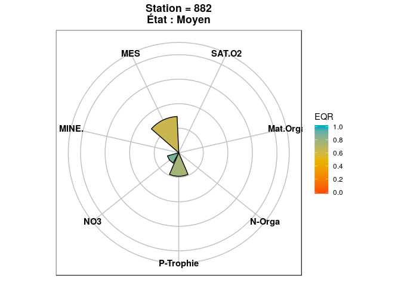
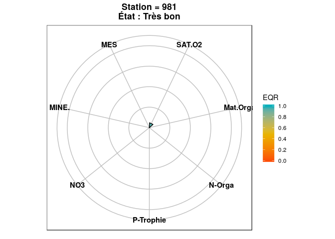

<!-- README.md is generated from README.Rmd. Please edit that file -->

# IDGF

L’objectif de ce package est de fournir un outil de calcul complet de
l’IDGF intégrant les tables de référence (transcodage, référence par
HER) pour tout utilisateur initié à R.

> Note : Ceci est un programme libre; vous pouvez le redistribuer ou le
> modifier suivant les termes de la GNU General Public License (GPL)
> telle que publiée par la Free Software Foundation; soit la version 3
> de la licence, soit (a votre gré) toute version ultérieure. Ce travail
> est diffusé dans l’espoir qu’il sera utile, mais **sans aucune
> garantie de qualité marchande ou d’adéquation à un but particulier**.

## Installation

En attendant son déploiement sur le CRAN, ce package peut être installé
manuellement ou par la commande suivant (nécessite une connexion
internet) :

``` r
if (!require(devtools)){install.packages("devtools")}

devtools::install_github("irstea/IDGF")
```

Puis, on charge le package :

``` r
library(IDGF)
```

## Description

Le package est actuellement composé de deux fonctions et d’un jeu de
données fictif :

  - `IDGF()` permet le calcul de l’indice et renvoie un tableau
    contenant les valeurs des différentes métriques (exprimées en EQR),
    une indication sur la robustesse de l’indice ainsi que la proportion
    et identité des taxons inconnus ou halins. Les résultats peuvent
    être exprimés en deux langues contrôlé par l’argument “lang” qui
    n’accepte que deux valeurs : “FR” pour français (par défaut) et
    “ENG” pour anglais.

Le format d’entrée attendu correspond au jeu de données fictif intégré
au package `taxa.GF` et est le suivant :

``` r
head(taxa.GF)
#> # A tibble: 6 x 4
#>   cd_opecont cd_taxon abondance   her
#>        <int> <chr>        <dbl> <int>
#> 1        792 ADCT           118     2
#> 2        792 ZZZZ             3     2
#> 3        792 ADM2            24     2
#> 4        792 ADMA            15     2
#> 5        792 CA07             1     2
#> 6        792 CADH             1     2
```

Les noms de chaque colonne peuvent être différents, mais l’ordre des 4
colonnes doit être scrupuleusement suivi. Aucun texte ne doit être
introduit dans les colonnes d’abondance ou d’HER. L’HER 1 correspond à
la plaine littorale du nord tandis que l’HER 2 correspond au bouclier
guyanais.

  - `Diagnostic_IDGF()` trace les diagrammes d’appui au diagnostic et
    prend comme entrée les résultats de la fonction `IDGF()`

## Exemple

Dans un premier temps, l’IDGF peut simplement être calculé et stocké
dans un objet `results` :

``` r
results <- IDGF(df = taxa.GF, lang = "FR")
#> 1/4 : Vérification des données
#> 2/4 : Standardisation et transcodage
#> 3/4 : Calcul des métriques brutes
#> 4/4 : Calcul de l'IDGF et aggrégation
#> ✓ Calcul de l'IDGF terminé
```

On affiche le tableau de sortie :

``` r
results
#> # A tibble: 12 x 16
#>    id_releve pourcentage_ind… pourcentage_hal… MES   MINER MORGA NO3  
#>        <int>            <dbl>            <dbl> <chr> <chr> <chr> <chr>
#>  1       792             98.5              0   0.94  0.94  0.99  0.97 
#>  2       821             98.2              0   0.26  1     1     1    
#>  3       841             94                0   1     1     0.74  0.96 
#>  4       851             98.8              0   0.93  1     1     1    
#>  5       882            100                0   0.63  1     1     0.88 
#>  6       899             87                0   1     1     1     0.84 
#>  7       912             92.8              0.5 0.58  1     0.79  0.91 
#>  8       928             74.8              0   ""    ""    ""    ""   
#>  9       952             82.5              0   0.98  0.99  1     0.93 
#> 10       968             99.2              0   0.74  0.89  0.98  0.97 
#> 11       981             95.2              0   1     1     1     1    
#> 12      1043             69.2              0   ""    ""    ""    ""   
#> # … with 9 more variables: NORG <chr>, PTROPHIE <chr>, SAT <chr>,
#> #   IDGF <chr>, NumClasse <chr>, Classe <chr>, fiabilité <chr>,
#> #   Taxons_halins <chr>, Taxons_inconnus <chr>
```

Ensuite, nous ne conservons qu’une fraction des relevés pour l’exemple :

``` r
frac_results <- filter(results,id_releve %in% c("882","821")) 
```

Nous pouvons tracer les diagrammes d’appui au diagnostic pour ces deux
relevés :

``` r
Diagnostic_IDGF(result_IDGF = frac_results)
```

<!-- -->

    #> ✓821

<!-- -->

    #> ✓882
