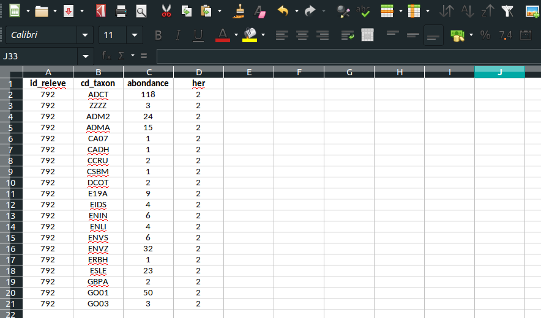

<!-- README.md is generated from README.Rmd. Please edit that file -->

# Applicatif simplifié de calcul R pour l’IDGF


# Préambule

La Directive Cadre sur l’Eau (DCE) impose aux états membres de l’Union
Européenne un suivi de la qualité écologique de leurs masses d’eau via
l’étude de compartiments biologiques clés du milieu aquatique. La
Guyane Française est un Département d’Outre-Mer (DOM) situé dans la
partie Amazonienne de l’Amérique du sud. Ce département, malgré son
éloignement, est un territoire européen comme tous les autres DOM et
est donc soumis aux prescriptions de la DCE. Les travaux de la dernière
décennie, notamment sur le compartiment diatomique, ont mené à
l’élaboration de plusieurs nouveaux indices biologiques
spécifiquement adaptés aux conditions biogéographiques (substrats
géologiques, climat, faune et flore locale) de chacun de ces
territoires ultramarins.

Cependant, la conception d’un indice diatomique spécifique à la Guyane a
connu une progression plus lente, du fait des conditions naturelles
particulières qui mènent à des cortèges diatomiques très spécifiques et
encore fortement méconnus. En l’absence d’un dispositif plus adapté, un
système réglementaire d’évaluation basé sur une adaptation locale de
l’IPS a été mis en place pour mesurer l’État Écologique des cours
d’eau de Guyane (cf. Arrêté Évaluation du 27 Juillet 2015), malgré des
faiblesses évidentes liées au décalage biogéographique du profil de
beaucoup de taxons de l’IPS, établis à partir de données mondiales.
Cependant, l’augmentation progressive des référentiels capitalisés dans
le cadre des réseaux de suivi Guyanais sur ces 9 dernières années, ainsi
que les progrès réalisés sur la taxonomie, ont rendu possible la
réalisation de la présente étude 2017-2018 visant à l’élaboration d’un
nouvel Indice Diatomique pour la Guyane Française (IDGF).

En tirant les enseignements adéquats des précédents indices diatomiques
élaborés dans d’autres DOM-COM, une méthodologie adaptée au contexte
Guyanais a été développée en se basant (i) sur une réduction du nombre
de taxons pris en compte dans les assemblages et (ii) sur la recherche
de taxons d’alerte dans une optique multimétrique. Cette approche a
permis la conception d’un indice qui présente une évaluation écologique
compatible avec les préconisations de la DCE (notion d’écart à une
référence régionale) et donne des résultats pertinents, selon l’avis
des experts locaux, et cohérents par rapport au contexte naturel et aux
activités anthropiques rencontrés en Guyane.

La présente notice d’utilisation accompagne le package R `IDGF` qui a
été développé lors de ce travail et permet de l’utiliser correctement
pour calculer une note d’IDGF, la classe de qualité écologique qui en
découle ainsi que de produire un diagramme d’appui au diagnostic de
l’état écologique des masses d’eau continentales Guyanaises.

# Pré-requis

## Installation de R / Rstudio

L’applicatif de calcul IDGF a été développé en langage R et nécessite
donc l’installation de ce programme pour son exécution.

Ce tutoriel liste les principales étapes à suivre pour installer R
facilement (Vous pouvez ignorer les notes préliminaires sur les outils
supplémentaires à installer) :

<https://stt4230.rbind.io/introduction/installation_r_rstudio>

Il est vivement conseillé d’installer Rstudio à la suite de R (toujours
en suivant ce tutoriel). Rstudio est une interface graphique permettant
d’exécuter des programmes R de façon plus conviviale que via la console
R classique.

**Important** : Pour les utilisateurs Windows, il est important de
suivre la procédure de ce tutoriel pour installer RTools. En effet, la
majorité des packages récemment développés sous R (tels que le package
IDGF) s’appuient sur des librairies (modules externes) qui nécessitent
l’installation du programme Rtools.

## Prise en main de R

Si vous découvrez R, alors nous vous conseillons la lecture du chapitre
suivant :

<https://stt4230.rbind.io/introduction/base_r/>

# Installation du package IDGF

## Depuis l’espace Hydrobio-DCE (version “stable”)

Cet applicatif accompagné de sa notice utilisateur sont disponibles au
téléchargement sur le site Hydrobio-DCE :
<https://hydrobio-dce.inrae.fr/>.

Dans l’archive (.zip) téléchargée depuis cet espace, se trouvent la
présente notice, un fichier de projet Rstudio
`Applicatif_IDGF_HydrobioDCE.Rproj` ainsi qu’une archive au format
`.tar.gz`. Cette archive est un package R contenant les fonctions
nécessaires pour la réalisation de l’IDGF. Après extraction (**du .zip,
et non du .targ.gz**) sur votre ordinateur, vous pouvez ouvrir le
fichier de projet `Applicatif_IDGF_HydrobioDCE.Rproj`, ce qui ouvrira
directement Rstudio correctement configuré.

Pour installer le package IDGF ainsi que ses dépendences associées, vous
pouvez exécuter dans la console
:

``` r
if (!"remotes" %in% rownames(installed.packages())) {install.packages("remotes")}
remotes::install_local("IDGF_2.0.tar.gz")
```

Ceci devrait installer le package ainsi que ses dépendances. Cette
opération peut être chronophage si vous n’avez jamais installé de
packages R auparavant.

**En cas d’erreur, merci de vérifier que RTools soit bien installé**

Si l’installation s’est bien passée, alors la commande suivante devrait
fonctionner :

``` r
library(IDGF)
```

## Depuis la forge logicielle GitHub (version “développeur”)

La version en cours de développement du package R est également hébergée
sur github :

<https://github.com/davidcarayon/IDGF>

Il est donc possible d’installer le package par la fonction suivante
:

``` r
if (!"remotes" %in% rownames(installed.packages())) {install.packages("remotes")}
remotes::install_github("davidcarayon/IDGF")
```

Ici encore si l’installation s’est bien passée, alors la commande
suivante devrait fonctionner :

``` r
library(IDGF)
```

# Présentation de l’applicatif

## Modules et fonctionnalités

Le package IDGF est constitué de 4 modules interconnectés :

  - `importIDGF()` : Importe les données dans R à partir d’un fichier de
    données (type excel), puis applique quelques transformations telles
    que des transcodages de synonymes.

  - `computeIDGF()` : Calcule, à partir des données importées via la
    fonction précédente, les différentes métriques de l’IDGF en se
    basant sur des tableaux internes listant le statut de chaque taxon
    (alerte, halin, etc.) ainsi que les valeurs de référence pour chaque
    HER.

  - `radarIDGF()` : Module facultatif qui produit des diagrammes radar
    d’appui au diagnostic à partir des résultats de la fonction
    précédente.

  - `exportIDGF()` : Exporte les résultats de l’IDGF (score des
    métriques individuelles, évaluation de l’état écologique) au format
    .csv et les diagrammes de diagnostic au format .png (si la fonction
    de radar a été utilisée).


## Données internes embarquées

L’outil de calcul IDGF fait appel à différentes tables de référence qui
ont été construites lors de la création de l’indice et qui sont stockées
dans un fichier interne au package. Ces tables de référence sont au
nombre de 3 :

1.  `transcode` : Table de transcodage permettant de faire correspondre
    un code taxon 4-lettres (type OMNIDIA) à son entité taxonomique qui
    a été considérée pour la construction de l’IDGF. Cette table recence
    les 2022 codes taxon possibles identifiés jusqu’à maintenant en
    Guyane et va donner pour chacun de ces codes sa correspondance à un
    code accepté pour l’IDGF (notamment dans le cas de synonymes ou
    d’évolution des connaissances taxonomiques). Dans l’extrait
    ci-dessous, la colonne ‘v1’ correspond au code utilisé par l’IDGF
    pour sa première version finalée tandis que la colonne v2 est en
    cours de construction pour une future version de l’indice.

<!--html_preserve-->

<style>html {
  font-family: -apple-system, BlinkMacSystemFont, 'Segoe UI', Roboto, Oxygen, Ubuntu, Cantarell, 'Helvetica Neue', 'Fira Sans', 'Droid Sans', Arial, sans-serif;
}

#yljwldsyak .gt_table {
  display: table;
  border-collapse: collapse;
  margin-left: auto;
  /* table.margin.left */
  margin-right: auto;
  /* table.margin.right */
  color: #333333;
  font-size: 16px;
  /* table.font.size */
  background-color: #FFFFFF;
  /* table.background.color */
  width: auto;
  /* table.width */
  border-top-style: solid;
  /* table.border.top.style */
  border-top-width: 2px;
  /* table.border.top.width */
  border-top-color: #A8A8A8;
  /* table.border.top.color */
  border-bottom-style: solid;
  /* table.border.bottom.style */
  border-bottom-width: 2px;
  /* table.border.bottom.width */
  border-bottom-color: #A8A8A8;
  /* table.border.bottom.color */
}

#yljwldsyak .gt_heading {
  background-color: #FFFFFF;
  /* heading.background.color */
  border-bottom-color: #FFFFFF;
  /* table.background.color */
  border-left-style: hidden;
  /* heading.border.lr.style */
  border-left-width: 1px;
  /* heading.border.lr.width */
  border-left-color: #D3D3D3;
  /* heading.border.lr.color */
  border-right-style: hidden;
  /* heading.border.lr.style */
  border-right-width: 1px;
  /* heading.border.lr.width */
  border-right-color: #D3D3D3;
  /* heading.border.lr.color */
}

#yljwldsyak .gt_title {
  color: #333333;
  font-size: 125%;
  /* heading.title.font.size */
  font-weight: initial;
  /* heading.title.font.weight */
  padding-top: 4px;
  /* heading.top.padding - not yet used */
  padding-bottom: 4px;
  border-bottom-color: #FFFFFF;
  /* table.background.color */
  border-bottom-width: 0;
}

#yljwldsyak .gt_subtitle {
  color: #333333;
  font-size: 85%;
  /* heading.subtitle.font.size */
  font-weight: initial;
  /* heading.subtitle.font.weight */
  padding-top: 0;
  padding-bottom: 4px;
  /* heading.bottom.padding - not yet used */
  border-top-color: #FFFFFF;
  /* table.background.color */
  border-top-width: 0;
}

#yljwldsyak .gt_bottom_border {
  border-bottom-style: solid;
  /* heading.border.bottom.style */
  border-bottom-width: 2px;
  /* heading.border.bottom.width */
  border-bottom-color: #D3D3D3;
  /* heading.border.bottom.color */
}

#yljwldsyak .gt_column_spanner {
  border-bottom-style: solid;
  border-bottom-width: 2px;
  border-bottom-color: #D3D3D3;
  padding-top: 4px;
  padding-bottom: 4px;
}

#yljwldsyak .gt_col_headings {
  border-top-style: solid;
  /* column_labels.border.top.style */
  border-top-width: 2px;
  /* column_labels.border.top.width */
  border-top-color: #D3D3D3;
  /* column_labels.border.top.color */
  border-bottom-style: solid;
  /* column_labels.border.bottom.style */
  border-bottom-width: 2px;
  /* column_labels.border.bottom.width */
  border-bottom-color: #D3D3D3;
  /* column_labels.border.bottom.color */
  border-left-style: none;
  /* column_labels.border.lr.style */
  border-left-width: 1px;
  /* column_labels.border.lr.width */
  border-left-color: #D3D3D3;
  /* column_labels.border.lr.color */
  border-right-style: none;
  /* column_labels.border.lr.style */
  border-right-width: 1px;
  /* column_labels.border.lr.width */
  border-right-color: #D3D3D3;
  /* column_labels.border.lr.color */
}

#yljwldsyak .gt_col_heading {
  color: #333333;
  background-color: #FFFFFF;
  /* column_labels.background.color */
  font-size: 100%;
  /* column_labels.font.size */
  font-weight: normal;
  /* column_labels.font.weight */
  text-transform: inherit;
  /* column_labels.text_transform */
  vertical-align: middle;
  padding: 5px;
  margin: 10px;
  overflow-x: hidden;
}

#yljwldsyak .gt_sep_right {
  border-right: 5px solid #FFFFFF;
}

#yljwldsyak .gt_group_heading {
  padding: 8px;
  /* row_group.padding */
  color: #333333;
  background-color: #FFFFFF;
  /* row_group.background.color */
  font-size: 100%;
  /* row_group.font.size */
  font-weight: initial;
  /* row_group.font.weight */
  text-transform: inherit;
  /* row_group.text_transform */
  border-top-style: solid;
  /* row_group.border.top.style */
  border-top-width: 2px;
  /* row_group.border.top.width */
  border-top-color: #D3D3D3;
  /* row_group.border.top.color */
  border-bottom-style: solid;
  /* row_group.border.bottom.style */
  border-bottom-width: 2px;
  /* row_group.border.bottom.width */
  border-bottom-color: #D3D3D3;
  /* row_group.border.bottom.color */
  border-left-style: none;
  /* row_group.border.left.style */
  border-left-width: 1px;
  /* row_group.border.left.width */
  border-left-color: #D3D3D3;
  /* row_group.border.left.color */
  border-right-style: none;
  /* row_group.border.right.style */
  border-right-width: 1px;
  /* row_group.border.right.width */
  border-right-color: #D3D3D3;
  /* row_group.border.right.color */
  vertical-align: middle;
}

#yljwldsyak .gt_empty_group_heading {
  padding: 0.5px;
  color: #333333;
  background-color: #FFFFFF;
  /* row_group.background.color */
  font-size: 100%;
  /* row_group.font.size */
  font-weight: initial;
  /* row_group.font.weight */
  border-top-style: solid;
  /* row_group.border.top.style */
  border-top-width: 2px;
  /* row_group.border.top.width */
  border-top-color: #D3D3D3;
  /* row_group.border.top.color */
  border-bottom-style: solid;
  /* row_group.border.bottom.style */
  border-bottom-width: 2px;
  /* row_group.border.bottom.width */
  border-bottom-color: #D3D3D3;
  /* row_group.border.bottom.color */
  vertical-align: middle;
}

#yljwldsyak .gt_striped {
  background-color: rgba(128, 128, 128, 0.05);
  /* row.striping.background_color */
}

#yljwldsyak .gt_from_md > :first-child {
  margin-top: 0;
}

#yljwldsyak .gt_from_md > :last-child {
  margin-bottom: 0;
}

#yljwldsyak .gt_row {
  padding-top: 8px;
  /* data_row.padding */
  padding-bottom: 8px;
  /* data_row.padding */
  padding-left: 5px;
  padding-right: 5px;
  margin: 10px;
  border-top-style: solid;
  /* table_body.hlines.style */
  border-top-width: 1px;
  /* table_body.hlines.width */
  border-top-color: #D3D3D3;
  /* table_body.hlines.color */
  border-left-style: none;
  /* table_body.vlines.style */
  border-left-width: 1px;
  /* table_body.vlines.width */
  border-left-color: #D3D3D3;
  /* table_body.vlines.color */
  border-right-style: none;
  /* table_body.vlines.style */
  border-right-width: 1px;
  /* table_body.vlines.width */
  border-right-color: #D3D3D3;
  /* table_body.vlines.color */
  vertical-align: middle;
  overflow-x: hidden;
}

#yljwldsyak .gt_stub {
  color: #333333;
  background-color: #FFFFFF;
  /* stub.background.color */
  font-weight: initial;
  /* stub.font.weight */
  text-transform: inherit;
  /* stub.text_transform */
  border-right-style: solid;
  /* stub.border.style */
  border-right-width: 2px;
  /* stub.border.width */
  border-right-color: #D3D3D3;
  /* stub.border.color */
  padding-left: 12px;
}

#yljwldsyak .gt_summary_row {
  color: #333333;
  background-color: #FFFFFF;
  /* summary_row.background.color */
  text-transform: inherit;
  /* summary_row.text_transform */
  padding-top: 8px;
  /* summary_row.padding */
  padding-bottom: 8px;
  /* summary_row.padding */
  padding-left: 5px;
  padding-right: 5px;
}

#yljwldsyak .gt_first_summary_row {
  padding-top: 8px;
  /* summary_row.padding */
  padding-bottom: 8px;
  /* summary_row.padding */
  padding-left: 5px;
  padding-right: 5px;
  border-top-style: solid;
  /* summary_row.border.style */
  border-top-width: 2px;
  /* summary_row.border.width */
  border-top-color: #D3D3D3;
  /* summary_row.border.color */
}

#yljwldsyak .gt_grand_summary_row {
  color: #333333;
  background-color: #FFFFFF;
  /* grand_summary_row.background.color */
  text-transform: inherit;
  /* grand_summary_row.text_transform */
  padding-top: 8px;
  /* grand_summary_row.padding */
  padding-bottom: 8px;
  /* grand_summary_row.padding */
  padding-left: 5px;
  padding-right: 5px;
}

#yljwldsyak .gt_first_grand_summary_row {
  padding-top: 8px;
  /* grand_summary_row.padding */
  padding-bottom: 8px;
  /* grand_summary_row.padding */
  padding-left: 5px;
  padding-right: 5px;
  border-top-style: double;
  /* grand_summary_row.border.style */
  border-top-width: 6px;
  /* grand_summary_row.border.width */
  border-top-color: #D3D3D3;
  /* grand_summary_row.border.color */
}

#yljwldsyak .gt_table_body {
  border-top-style: solid;
  /* table_body.border.top.style */
  border-top-width: 2px;
  /* table_body.border.top.width */
  border-top-color: #D3D3D3;
  /* table_body.border.top.color */
  border-bottom-style: solid;
  /* table_body.border.bottom.style */
  border-bottom-width: 2px;
  /* table_body.border.bottom.width */
  border-bottom-color: #D3D3D3;
  /* table_body.border.bottom.color */
}

#yljwldsyak .gt_footnotes {
  color: #333333;
  background-color: #FFFFFF;
  /* footnotes.background.color */
  border-bottom-style: none;
  /* footnotes.border.bottom.style */
  border-bottom-width: 2px;
  /* footnotes.border.bottom.width */
  border-bottom-color: #D3D3D3;
  /* footnotes.border.bottom.color */
  border-left-style: none;
  /* footnotes.border.lr.color */
  border-left-width: 2px;
  /* footnotes.border.lr.color */
  border-left-color: #D3D3D3;
  /* footnotes.border.lr.color */
  border-right-style: none;
  /* footnotes.border.lr.color */
  border-right-width: 2px;
  /* footnotes.border.lr.color */
  border-right-color: #D3D3D3;
  /* footnotes.border.lr.color */
}

#yljwldsyak .gt_footnote {
  margin: 0px;
  font-size: 90%;
  /* footnotes.font.size */
  padding: 4px;
  /* footnotes.padding */
}

#yljwldsyak .gt_sourcenotes {
  color: #333333;
  background-color: #FFFFFF;
  /* source_notes.background.color */
  border-bottom-style: none;
  /* source_notes.border.bottom.style */
  border-bottom-width: 2px;
  /* source_notes.border.bottom.width */
  border-bottom-color: #D3D3D3;
  /* source_notes.border.bottom.color */
  border-left-style: none;
  /* source_notes.border.lr.style */
  border-left-width: 2px;
  /* source_notes.border.lr.style */
  border-left-color: #D3D3D3;
  /* source_notes.border.lr.style */
  border-right-style: none;
  /* source_notes.border.lr.style */
  border-right-width: 2px;
  /* source_notes.border.lr.style */
  border-right-color: #D3D3D3;
  /* source_notes.border.lr.style */
}

#yljwldsyak .gt_sourcenote {
  font-size: 90%;
  /* source_notes.font.size */
  padding: 4px;
  /* source_notes.padding */
}

#yljwldsyak .gt_left {
  text-align: left;
}

#yljwldsyak .gt_center {
  text-align: center;
}

#yljwldsyak .gt_right {
  text-align: right;
  font-variant-numeric: tabular-nums;
}

#yljwldsyak .gt_font_normal {
  font-weight: normal;
}

#yljwldsyak .gt_font_bold {
  font-weight: bold;
}

#yljwldsyak .gt_font_italic {
  font-style: italic;
}

#yljwldsyak .gt_super {
  font-size: 65%;
}

#yljwldsyak .gt_footnote_marks {
  font-style: italic;
  font-size: 65%;
}
</style>

<div id="yljwldsyak" style="overflow-x:auto;overflow-y:auto;width:auto;height:auto;">

<table class="gt_table">

<thead class="gt_col_headings">

<tr>

<th class="gt_col_heading gt_columns_bottom_border gt_left" rowspan="1" colspan="1">

Groupe

</th>

<th class="gt_col_heading gt_columns_bottom_border gt_left" rowspan="1" colspan="1">

Ordre

</th>

<th class="gt_col_heading gt_columns_bottom_border gt_left" rowspan="1" colspan="1">

Genre

</th>

<th class="gt_col_heading gt_columns_bottom_border gt_left" rowspan="1" colspan="1">

nom\_taxon

</th>

<th class="gt_col_heading gt_columns_bottom_border gt_left" rowspan="1" colspan="1">

code

</th>

<th class="gt_col_heading gt_columns_bottom_border gt_left" rowspan="1" colspan="1">

IDGF\_v1

</th>

<th class="gt_col_heading gt_columns_bottom_border gt_center" rowspan="1" colspan="1">

IDGF\_v2

</th>

</tr>

</thead>

<tbody class="gt_table_body">

<tr>

<td class="gt_row gt_left">

Bacillariacees

</td>

<td class="gt_row gt_left">

Bacillariales

</td>

<td class="gt_row gt_left">

Bacillaria

</td>

<td class="gt_row gt_left">

Bacillaria paxillifera

</td>

<td class="gt_row gt_left">

BPAX

</td>

<td class="gt_row gt_left">

BPAX

</td>

<td class="gt_row gt_center">

BPAX

</td>

</tr>

<tr>

<td class="gt_row gt_left gt_striped">

Bacillariacees

</td>

<td class="gt_row gt_left gt_striped">

Bacillariales

</td>

<td class="gt_row gt_left gt_striped">

Cylindrotheca

</td>

<td class="gt_row gt_left gt_striped">

Cylindrotheca gracilis

</td>

<td class="gt_row gt_left gt_striped">

CYGR

</td>

<td class="gt_row gt_left gt_striped">

CYGR

</td>

<td class="gt_row gt_center gt_striped">

CYGR

</td>

</tr>

<tr>

<td class="gt_row gt_left">

Bacillariacees

</td>

<td class="gt_row gt_left">

Bacillariales

</td>

<td class="gt_row gt_left">

Denticula

</td>

<td class="gt_row gt_left">

Denticula sundayensis

</td>

<td class="gt_row gt_left">

DSUN

</td>

<td class="gt_row gt_left">

DSUN

</td>

<td class="gt_row gt_center">

DSUN

</td>

</tr>

<tr>

<td class="gt_row gt_left gt_striped">

Bacillariacees

</td>

<td class="gt_row gt_left gt_striped">

Bacillariales

</td>

<td class="gt_row gt_left gt_striped">

Hantzschia

</td>

<td class="gt_row gt_left gt_striped">

Hantzschia amphyoxis

</td>

<td class="gt_row gt_left gt_striped">

HAMP

</td>

<td class="gt_row gt_left gt_striped">

HAMP

</td>

<td class="gt_row gt_center gt_striped">

HAMP

</td>

</tr>

<tr>

<td class="gt_row gt_left">

Bacillariacees

</td>

<td class="gt_row gt_left">

Bacillariales

</td>

<td class="gt_row gt_left">

Hantzschia

</td>

<td class="gt_row gt_left">

Hantzschia sp1 (abundans?)

</td>

<td class="gt_row gt_left">

HA01

</td>

<td class="gt_row gt_left">

HA01

</td>

<td class="gt_row gt_center">

HA01

</td>

</tr>

<tr>

<td class="gt_row gt_left gt_striped">

Bacillariacees

</td>

<td class="gt_row gt_left gt_striped">

Bacillariales

</td>

<td class="gt_row gt_left gt_striped">

Nitzschia

</td>

<td class="gt_row gt_left gt_striped">

Nitzschia acidoclinata

</td>

<td class="gt_row gt_left gt_striped">

NACD

</td>

<td class="gt_row gt_left gt_striped">

NACD

</td>

<td class="gt_row gt_center gt_striped">

NACD

</td>

</tr>

</tbody>

</table>

</div>

<!--/html_preserve-->

2.  `table_metrics` : Table contenant une information binaire pour
    chaque taxon et donnant une indication sur si le taxon considéré est
    halin, indiciel (utilisé pour l’indice), ou taxon d’alerte d’un ou
    plusieurs paramètres d’anthropisation (et si oui, desquels).
    Ci-dessous un extrait :

<!--html_preserve-->

<style>html {
  font-family: -apple-system, BlinkMacSystemFont, 'Segoe UI', Roboto, Oxygen, Ubuntu, Cantarell, 'Helvetica Neue', 'Fira Sans', 'Droid Sans', Arial, sans-serif;
}

#rjysufgqkf .gt_table {
  display: table;
  border-collapse: collapse;
  margin-left: auto;
  /* table.margin.left */
  margin-right: auto;
  /* table.margin.right */
  color: #333333;
  font-size: 16px;
  /* table.font.size */
  background-color: #FFFFFF;
  /* table.background.color */
  width: auto;
  /* table.width */
  border-top-style: solid;
  /* table.border.top.style */
  border-top-width: 2px;
  /* table.border.top.width */
  border-top-color: #A8A8A8;
  /* table.border.top.color */
  border-bottom-style: solid;
  /* table.border.bottom.style */
  border-bottom-width: 2px;
  /* table.border.bottom.width */
  border-bottom-color: #A8A8A8;
  /* table.border.bottom.color */
}

#rjysufgqkf .gt_heading {
  background-color: #FFFFFF;
  /* heading.background.color */
  border-bottom-color: #FFFFFF;
  /* table.background.color */
  border-left-style: hidden;
  /* heading.border.lr.style */
  border-left-width: 1px;
  /* heading.border.lr.width */
  border-left-color: #D3D3D3;
  /* heading.border.lr.color */
  border-right-style: hidden;
  /* heading.border.lr.style */
  border-right-width: 1px;
  /* heading.border.lr.width */
  border-right-color: #D3D3D3;
  /* heading.border.lr.color */
}

#rjysufgqkf .gt_title {
  color: #333333;
  font-size: 125%;
  /* heading.title.font.size */
  font-weight: initial;
  /* heading.title.font.weight */
  padding-top: 4px;
  /* heading.top.padding - not yet used */
  padding-bottom: 4px;
  border-bottom-color: #FFFFFF;
  /* table.background.color */
  border-bottom-width: 0;
}

#rjysufgqkf .gt_subtitle {
  color: #333333;
  font-size: 85%;
  /* heading.subtitle.font.size */
  font-weight: initial;
  /* heading.subtitle.font.weight */
  padding-top: 0;
  padding-bottom: 4px;
  /* heading.bottom.padding - not yet used */
  border-top-color: #FFFFFF;
  /* table.background.color */
  border-top-width: 0;
}

#rjysufgqkf .gt_bottom_border {
  border-bottom-style: solid;
  /* heading.border.bottom.style */
  border-bottom-width: 2px;
  /* heading.border.bottom.width */
  border-bottom-color: #D3D3D3;
  /* heading.border.bottom.color */
}

#rjysufgqkf .gt_column_spanner {
  border-bottom-style: solid;
  border-bottom-width: 2px;
  border-bottom-color: #D3D3D3;
  padding-top: 4px;
  padding-bottom: 4px;
}

#rjysufgqkf .gt_col_headings {
  border-top-style: solid;
  /* column_labels.border.top.style */
  border-top-width: 2px;
  /* column_labels.border.top.width */
  border-top-color: #D3D3D3;
  /* column_labels.border.top.color */
  border-bottom-style: solid;
  /* column_labels.border.bottom.style */
  border-bottom-width: 2px;
  /* column_labels.border.bottom.width */
  border-bottom-color: #D3D3D3;
  /* column_labels.border.bottom.color */
  border-left-style: none;
  /* column_labels.border.lr.style */
  border-left-width: 1px;
  /* column_labels.border.lr.width */
  border-left-color: #D3D3D3;
  /* column_labels.border.lr.color */
  border-right-style: none;
  /* column_labels.border.lr.style */
  border-right-width: 1px;
  /* column_labels.border.lr.width */
  border-right-color: #D3D3D3;
  /* column_labels.border.lr.color */
}

#rjysufgqkf .gt_col_heading {
  color: #333333;
  background-color: #FFFFFF;
  /* column_labels.background.color */
  font-size: 100%;
  /* column_labels.font.size */
  font-weight: normal;
  /* column_labels.font.weight */
  text-transform: inherit;
  /* column_labels.text_transform */
  vertical-align: middle;
  padding: 5px;
  margin: 10px;
  overflow-x: hidden;
}

#rjysufgqkf .gt_sep_right {
  border-right: 5px solid #FFFFFF;
}

#rjysufgqkf .gt_group_heading {
  padding: 8px;
  /* row_group.padding */
  color: #333333;
  background-color: #FFFFFF;
  /* row_group.background.color */
  font-size: 100%;
  /* row_group.font.size */
  font-weight: initial;
  /* row_group.font.weight */
  text-transform: inherit;
  /* row_group.text_transform */
  border-top-style: solid;
  /* row_group.border.top.style */
  border-top-width: 2px;
  /* row_group.border.top.width */
  border-top-color: #D3D3D3;
  /* row_group.border.top.color */
  border-bottom-style: solid;
  /* row_group.border.bottom.style */
  border-bottom-width: 2px;
  /* row_group.border.bottom.width */
  border-bottom-color: #D3D3D3;
  /* row_group.border.bottom.color */
  border-left-style: none;
  /* row_group.border.left.style */
  border-left-width: 1px;
  /* row_group.border.left.width */
  border-left-color: #D3D3D3;
  /* row_group.border.left.color */
  border-right-style: none;
  /* row_group.border.right.style */
  border-right-width: 1px;
  /* row_group.border.right.width */
  border-right-color: #D3D3D3;
  /* row_group.border.right.color */
  vertical-align: middle;
}

#rjysufgqkf .gt_empty_group_heading {
  padding: 0.5px;
  color: #333333;
  background-color: #FFFFFF;
  /* row_group.background.color */
  font-size: 100%;
  /* row_group.font.size */
  font-weight: initial;
  /* row_group.font.weight */
  border-top-style: solid;
  /* row_group.border.top.style */
  border-top-width: 2px;
  /* row_group.border.top.width */
  border-top-color: #D3D3D3;
  /* row_group.border.top.color */
  border-bottom-style: solid;
  /* row_group.border.bottom.style */
  border-bottom-width: 2px;
  /* row_group.border.bottom.width */
  border-bottom-color: #D3D3D3;
  /* row_group.border.bottom.color */
  vertical-align: middle;
}

#rjysufgqkf .gt_striped {
  background-color: rgba(128, 128, 128, 0.05);
  /* row.striping.background_color */
}

#rjysufgqkf .gt_from_md > :first-child {
  margin-top: 0;
}

#rjysufgqkf .gt_from_md > :last-child {
  margin-bottom: 0;
}

#rjysufgqkf .gt_row {
  padding-top: 8px;
  /* data_row.padding */
  padding-bottom: 8px;
  /* data_row.padding */
  padding-left: 5px;
  padding-right: 5px;
  margin: 10px;
  border-top-style: solid;
  /* table_body.hlines.style */
  border-top-width: 1px;
  /* table_body.hlines.width */
  border-top-color: #D3D3D3;
  /* table_body.hlines.color */
  border-left-style: none;
  /* table_body.vlines.style */
  border-left-width: 1px;
  /* table_body.vlines.width */
  border-left-color: #D3D3D3;
  /* table_body.vlines.color */
  border-right-style: none;
  /* table_body.vlines.style */
  border-right-width: 1px;
  /* table_body.vlines.width */
  border-right-color: #D3D3D3;
  /* table_body.vlines.color */
  vertical-align: middle;
  overflow-x: hidden;
}

#rjysufgqkf .gt_stub {
  color: #333333;
  background-color: #FFFFFF;
  /* stub.background.color */
  font-weight: initial;
  /* stub.font.weight */
  text-transform: inherit;
  /* stub.text_transform */
  border-right-style: solid;
  /* stub.border.style */
  border-right-width: 2px;
  /* stub.border.width */
  border-right-color: #D3D3D3;
  /* stub.border.color */
  padding-left: 12px;
}

#rjysufgqkf .gt_summary_row {
  color: #333333;
  background-color: #FFFFFF;
  /* summary_row.background.color */
  text-transform: inherit;
  /* summary_row.text_transform */
  padding-top: 8px;
  /* summary_row.padding */
  padding-bottom: 8px;
  /* summary_row.padding */
  padding-left: 5px;
  padding-right: 5px;
}

#rjysufgqkf .gt_first_summary_row {
  padding-top: 8px;
  /* summary_row.padding */
  padding-bottom: 8px;
  /* summary_row.padding */
  padding-left: 5px;
  padding-right: 5px;
  border-top-style: solid;
  /* summary_row.border.style */
  border-top-width: 2px;
  /* summary_row.border.width */
  border-top-color: #D3D3D3;
  /* summary_row.border.color */
}

#rjysufgqkf .gt_grand_summary_row {
  color: #333333;
  background-color: #FFFFFF;
  /* grand_summary_row.background.color */
  text-transform: inherit;
  /* grand_summary_row.text_transform */
  padding-top: 8px;
  /* grand_summary_row.padding */
  padding-bottom: 8px;
  /* grand_summary_row.padding */
  padding-left: 5px;
  padding-right: 5px;
}

#rjysufgqkf .gt_first_grand_summary_row {
  padding-top: 8px;
  /* grand_summary_row.padding */
  padding-bottom: 8px;
  /* grand_summary_row.padding */
  padding-left: 5px;
  padding-right: 5px;
  border-top-style: double;
  /* grand_summary_row.border.style */
  border-top-width: 6px;
  /* grand_summary_row.border.width */
  border-top-color: #D3D3D3;
  /* grand_summary_row.border.color */
}

#rjysufgqkf .gt_table_body {
  border-top-style: solid;
  /* table_body.border.top.style */
  border-top-width: 2px;
  /* table_body.border.top.width */
  border-top-color: #D3D3D3;
  /* table_body.border.top.color */
  border-bottom-style: solid;
  /* table_body.border.bottom.style */
  border-bottom-width: 2px;
  /* table_body.border.bottom.width */
  border-bottom-color: #D3D3D3;
  /* table_body.border.bottom.color */
}

#rjysufgqkf .gt_footnotes {
  color: #333333;
  background-color: #FFFFFF;
  /* footnotes.background.color */
  border-bottom-style: none;
  /* footnotes.border.bottom.style */
  border-bottom-width: 2px;
  /* footnotes.border.bottom.width */
  border-bottom-color: #D3D3D3;
  /* footnotes.border.bottom.color */
  border-left-style: none;
  /* footnotes.border.lr.color */
  border-left-width: 2px;
  /* footnotes.border.lr.color */
  border-left-color: #D3D3D3;
  /* footnotes.border.lr.color */
  border-right-style: none;
  /* footnotes.border.lr.color */
  border-right-width: 2px;
  /* footnotes.border.lr.color */
  border-right-color: #D3D3D3;
  /* footnotes.border.lr.color */
}

#rjysufgqkf .gt_footnote {
  margin: 0px;
  font-size: 90%;
  /* footnotes.font.size */
  padding: 4px;
  /* footnotes.padding */
}

#rjysufgqkf .gt_sourcenotes {
  color: #333333;
  background-color: #FFFFFF;
  /* source_notes.background.color */
  border-bottom-style: none;
  /* source_notes.border.bottom.style */
  border-bottom-width: 2px;
  /* source_notes.border.bottom.width */
  border-bottom-color: #D3D3D3;
  /* source_notes.border.bottom.color */
  border-left-style: none;
  /* source_notes.border.lr.style */
  border-left-width: 2px;
  /* source_notes.border.lr.style */
  border-left-color: #D3D3D3;
  /* source_notes.border.lr.style */
  border-right-style: none;
  /* source_notes.border.lr.style */
  border-right-width: 2px;
  /* source_notes.border.lr.style */
  border-right-color: #D3D3D3;
  /* source_notes.border.lr.style */
}

#rjysufgqkf .gt_sourcenote {
  font-size: 90%;
  /* source_notes.font.size */
  padding: 4px;
  /* source_notes.padding */
}

#rjysufgqkf .gt_left {
  text-align: left;
}

#rjysufgqkf .gt_center {
  text-align: center;
}

#rjysufgqkf .gt_right {
  text-align: right;
  font-variant-numeric: tabular-nums;
}

#rjysufgqkf .gt_font_normal {
  font-weight: normal;
}

#rjysufgqkf .gt_font_bold {
  font-weight: bold;
}

#rjysufgqkf .gt_font_italic {
  font-style: italic;
}

#rjysufgqkf .gt_super {
  font-size: 65%;
}

#rjysufgqkf .gt_footnote_marks {
  font-style: italic;
  font-size: 65%;
}
</style>

<div id="rjysufgqkf" style="overflow-x:auto;overflow-y:auto;width:auto;height:auto;">

<table class="gt_table">

<thead class="gt_col_headings">

<tr>

<th class="gt_col_heading gt_columns_bottom_border gt_left" rowspan="1" colspan="1">

cd\_taxon

</th>

<th class="gt_col_heading gt_columns_bottom_border gt_right" rowspan="1" colspan="1">

indiciel

</th>

<th class="gt_col_heading gt_columns_bottom_border gt_right" rowspan="1" colspan="1">

halin

</th>

<th class="gt_col_heading gt_columns_bottom_border gt_right" rowspan="1" colspan="1">

MINER

</th>

<th class="gt_col_heading gt_columns_bottom_border gt_right" rowspan="1" colspan="1">

SAT

</th>

<th class="gt_col_heading gt_columns_bottom_border gt_right" rowspan="1" colspan="1">

COT

</th>

<th class="gt_col_heading gt_columns_bottom_border gt_right" rowspan="1" colspan="1">

DBO5

</th>

<th class="gt_col_heading gt_columns_bottom_border gt_right" rowspan="1" colspan="1">

DCO

</th>

<th class="gt_col_heading gt_columns_bottom_border gt_right" rowspan="1" colspan="1">

MES

</th>

<th class="gt_col_heading gt_columns_bottom_border gt_right" rowspan="1" colspan="1">

NK

</th>

<th class="gt_col_heading gt_columns_bottom_border gt_right" rowspan="1" colspan="1">

NO3

</th>

<th class="gt_col_heading gt_columns_bottom_border gt_right" rowspan="1" colspan="1">

PO4

</th>

<th class="gt_col_heading gt_columns_bottom_border gt_right" rowspan="1" colspan="1">

PTOT

</th>

<th class="gt_col_heading gt_columns_bottom_border gt_right" rowspan="1" colspan="1">

NH4

</th>

</tr>

</thead>

<tbody class="gt_table_body">

<tr>

<td class="gt_row gt_left">

NNOT

</td>

<td class="gt_row gt_right">

1

</td>

<td class="gt_row gt_right">

0

</td>

<td class="gt_row gt_right">

0

</td>

<td class="gt_row gt_right">

0

</td>

<td class="gt_row gt_right">

0

</td>

<td class="gt_row gt_right">

0

</td>

<td class="gt_row gt_right">

0

</td>

<td class="gt_row gt_right">

0

</td>

<td class="gt_row gt_right">

0

</td>

<td class="gt_row gt_right">

0

</td>

<td class="gt_row gt_right">

0

</td>

<td class="gt_row gt_right">

0

</td>

<td class="gt_row gt_right">

0

</td>

</tr>

<tr>

<td class="gt_row gt_left gt_striped">

EPAS

</td>

<td class="gt_row gt_right gt_striped">

1

</td>

<td class="gt_row gt_right gt_striped">

0

</td>

<td class="gt_row gt_right gt_striped">

0

</td>

<td class="gt_row gt_right gt_striped">

0

</td>

<td class="gt_row gt_right gt_striped">

0

</td>

<td class="gt_row gt_right gt_striped">

0

</td>

<td class="gt_row gt_right gt_striped">

0

</td>

<td class="gt_row gt_right gt_striped">

0

</td>

<td class="gt_row gt_right gt_striped">

0

</td>

<td class="gt_row gt_right gt_striped">

0

</td>

<td class="gt_row gt_right gt_striped">

0

</td>

<td class="gt_row gt_right gt_striped">

0

</td>

<td class="gt_row gt_right gt_striped">

0

</td>

</tr>

<tr>

<td class="gt_row gt_left">

NISA

</td>

<td class="gt_row gt_right">

1

</td>

<td class="gt_row gt_right">

0

</td>

<td class="gt_row gt_right">

0

</td>

<td class="gt_row gt_right">

0

</td>

<td class="gt_row gt_right">

0

</td>

<td class="gt_row gt_right">

0

</td>

<td class="gt_row gt_right">

0

</td>

<td class="gt_row gt_right">

0

</td>

<td class="gt_row gt_right">

0

</td>

<td class="gt_row gt_right">

0

</td>

<td class="gt_row gt_right">

0

</td>

<td class="gt_row gt_right">

0

</td>

<td class="gt_row gt_right">

0

</td>

</tr>

<tr>

<td class="gt_row gt_left gt_striped">

PLCA

</td>

<td class="gt_row gt_right gt_striped">

1

</td>

<td class="gt_row gt_right gt_striped">

0

</td>

<td class="gt_row gt_right gt_striped">

0

</td>

<td class="gt_row gt_right gt_striped">

0

</td>

<td class="gt_row gt_right gt_striped">

0

</td>

<td class="gt_row gt_right gt_striped">

0

</td>

<td class="gt_row gt_right gt_striped">

0

</td>

<td class="gt_row gt_right gt_striped">

0

</td>

<td class="gt_row gt_right gt_striped">

0

</td>

<td class="gt_row gt_right gt_striped">

0

</td>

<td class="gt_row gt_right gt_striped">

0

</td>

<td class="gt_row gt_right gt_striped">

0

</td>

<td class="gt_row gt_right gt_striped">

0

</td>

</tr>

<tr>

<td class="gt_row gt_left">

ENIN

</td>

<td class="gt_row gt_right">

1

</td>

<td class="gt_row gt_right">

0

</td>

<td class="gt_row gt_right">

0

</td>

<td class="gt_row gt_right">

0

</td>

<td class="gt_row gt_right">

0

</td>

<td class="gt_row gt_right">

0

</td>

<td class="gt_row gt_right">

0

</td>

<td class="gt_row gt_right">

0

</td>

<td class="gt_row gt_right">

0

</td>

<td class="gt_row gt_right">

0

</td>

<td class="gt_row gt_right">

0

</td>

<td class="gt_row gt_right">

0

</td>

<td class="gt_row gt_right">

0

</td>

</tr>

<tr>

<td class="gt_row gt_left gt_striped">

GPA1

</td>

<td class="gt_row gt_right gt_striped">

1

</td>

<td class="gt_row gt_right gt_striped">

0

</td>

<td class="gt_row gt_right gt_striped">

0

</td>

<td class="gt_row gt_right gt_striped">

0

</td>

<td class="gt_row gt_right gt_striped">

0

</td>

<td class="gt_row gt_right gt_striped">

0

</td>

<td class="gt_row gt_right gt_striped">

0

</td>

<td class="gt_row gt_right gt_striped">

0

</td>

<td class="gt_row gt_right gt_striped">

0

</td>

<td class="gt_row gt_right gt_striped">

0

</td>

<td class="gt_row gt_right gt_striped">

0

</td>

<td class="gt_row gt_right gt_striped">

0

</td>

<td class="gt_row gt_right gt_striped">

0

</td>

</tr>

</tbody>

</table>

</div>

<!--/html_preserve-->

3.  `table_ref` : Table contenant les valeurs de référence pour chaque
    paramètre *composite* d’anthropisation selon l’hydroécorégion
    considérée (1 pour la plaine littorale, 2 pour le bouclier
    Guyanais). Ci-dessous un extrait :

<!--html_preserve-->

<style>html {
  font-family: -apple-system, BlinkMacSystemFont, 'Segoe UI', Roboto, Oxygen, Ubuntu, Cantarell, 'Helvetica Neue', 'Fira Sans', 'Droid Sans', Arial, sans-serif;
}

#ainvvllgry .gt_table {
  display: table;
  border-collapse: collapse;
  margin-left: auto;
  /* table.margin.left */
  margin-right: auto;
  /* table.margin.right */
  color: #333333;
  font-size: 16px;
  /* table.font.size */
  background-color: #FFFFFF;
  /* table.background.color */
  width: auto;
  /* table.width */
  border-top-style: solid;
  /* table.border.top.style */
  border-top-width: 2px;
  /* table.border.top.width */
  border-top-color: #A8A8A8;
  /* table.border.top.color */
  border-bottom-style: solid;
  /* table.border.bottom.style */
  border-bottom-width: 2px;
  /* table.border.bottom.width */
  border-bottom-color: #A8A8A8;
  /* table.border.bottom.color */
}

#ainvvllgry .gt_heading {
  background-color: #FFFFFF;
  /* heading.background.color */
  border-bottom-color: #FFFFFF;
  /* table.background.color */
  border-left-style: hidden;
  /* heading.border.lr.style */
  border-left-width: 1px;
  /* heading.border.lr.width */
  border-left-color: #D3D3D3;
  /* heading.border.lr.color */
  border-right-style: hidden;
  /* heading.border.lr.style */
  border-right-width: 1px;
  /* heading.border.lr.width */
  border-right-color: #D3D3D3;
  /* heading.border.lr.color */
}

#ainvvllgry .gt_title {
  color: #333333;
  font-size: 125%;
  /* heading.title.font.size */
  font-weight: initial;
  /* heading.title.font.weight */
  padding-top: 4px;
  /* heading.top.padding - not yet used */
  padding-bottom: 4px;
  border-bottom-color: #FFFFFF;
  /* table.background.color */
  border-bottom-width: 0;
}

#ainvvllgry .gt_subtitle {
  color: #333333;
  font-size: 85%;
  /* heading.subtitle.font.size */
  font-weight: initial;
  /* heading.subtitle.font.weight */
  padding-top: 0;
  padding-bottom: 4px;
  /* heading.bottom.padding - not yet used */
  border-top-color: #FFFFFF;
  /* table.background.color */
  border-top-width: 0;
}

#ainvvllgry .gt_bottom_border {
  border-bottom-style: solid;
  /* heading.border.bottom.style */
  border-bottom-width: 2px;
  /* heading.border.bottom.width */
  border-bottom-color: #D3D3D3;
  /* heading.border.bottom.color */
}

#ainvvllgry .gt_column_spanner {
  border-bottom-style: solid;
  border-bottom-width: 2px;
  border-bottom-color: #D3D3D3;
  padding-top: 4px;
  padding-bottom: 4px;
}

#ainvvllgry .gt_col_headings {
  border-top-style: solid;
  /* column_labels.border.top.style */
  border-top-width: 2px;
  /* column_labels.border.top.width */
  border-top-color: #D3D3D3;
  /* column_labels.border.top.color */
  border-bottom-style: solid;
  /* column_labels.border.bottom.style */
  border-bottom-width: 2px;
  /* column_labels.border.bottom.width */
  border-bottom-color: #D3D3D3;
  /* column_labels.border.bottom.color */
  border-left-style: none;
  /* column_labels.border.lr.style */
  border-left-width: 1px;
  /* column_labels.border.lr.width */
  border-left-color: #D3D3D3;
  /* column_labels.border.lr.color */
  border-right-style: none;
  /* column_labels.border.lr.style */
  border-right-width: 1px;
  /* column_labels.border.lr.width */
  border-right-color: #D3D3D3;
  /* column_labels.border.lr.color */
}

#ainvvllgry .gt_col_heading {
  color: #333333;
  background-color: #FFFFFF;
  /* column_labels.background.color */
  font-size: 100%;
  /* column_labels.font.size */
  font-weight: normal;
  /* column_labels.font.weight */
  text-transform: inherit;
  /* column_labels.text_transform */
  vertical-align: middle;
  padding: 5px;
  margin: 10px;
  overflow-x: hidden;
}

#ainvvllgry .gt_sep_right {
  border-right: 5px solid #FFFFFF;
}

#ainvvllgry .gt_group_heading {
  padding: 8px;
  /* row_group.padding */
  color: #333333;
  background-color: #FFFFFF;
  /* row_group.background.color */
  font-size: 100%;
  /* row_group.font.size */
  font-weight: initial;
  /* row_group.font.weight */
  text-transform: inherit;
  /* row_group.text_transform */
  border-top-style: solid;
  /* row_group.border.top.style */
  border-top-width: 2px;
  /* row_group.border.top.width */
  border-top-color: #D3D3D3;
  /* row_group.border.top.color */
  border-bottom-style: solid;
  /* row_group.border.bottom.style */
  border-bottom-width: 2px;
  /* row_group.border.bottom.width */
  border-bottom-color: #D3D3D3;
  /* row_group.border.bottom.color */
  border-left-style: none;
  /* row_group.border.left.style */
  border-left-width: 1px;
  /* row_group.border.left.width */
  border-left-color: #D3D3D3;
  /* row_group.border.left.color */
  border-right-style: none;
  /* row_group.border.right.style */
  border-right-width: 1px;
  /* row_group.border.right.width */
  border-right-color: #D3D3D3;
  /* row_group.border.right.color */
  vertical-align: middle;
}

#ainvvllgry .gt_empty_group_heading {
  padding: 0.5px;
  color: #333333;
  background-color: #FFFFFF;
  /* row_group.background.color */
  font-size: 100%;
  /* row_group.font.size */
  font-weight: initial;
  /* row_group.font.weight */
  border-top-style: solid;
  /* row_group.border.top.style */
  border-top-width: 2px;
  /* row_group.border.top.width */
  border-top-color: #D3D3D3;
  /* row_group.border.top.color */
  border-bottom-style: solid;
  /* row_group.border.bottom.style */
  border-bottom-width: 2px;
  /* row_group.border.bottom.width */
  border-bottom-color: #D3D3D3;
  /* row_group.border.bottom.color */
  vertical-align: middle;
}

#ainvvllgry .gt_striped {
  background-color: rgba(128, 128, 128, 0.05);
  /* row.striping.background_color */
}

#ainvvllgry .gt_from_md > :first-child {
  margin-top: 0;
}

#ainvvllgry .gt_from_md > :last-child {
  margin-bottom: 0;
}

#ainvvllgry .gt_row {
  padding-top: 8px;
  /* data_row.padding */
  padding-bottom: 8px;
  /* data_row.padding */
  padding-left: 5px;
  padding-right: 5px;
  margin: 10px;
  border-top-style: solid;
  /* table_body.hlines.style */
  border-top-width: 1px;
  /* table_body.hlines.width */
  border-top-color: #D3D3D3;
  /* table_body.hlines.color */
  border-left-style: none;
  /* table_body.vlines.style */
  border-left-width: 1px;
  /* table_body.vlines.width */
  border-left-color: #D3D3D3;
  /* table_body.vlines.color */
  border-right-style: none;
  /* table_body.vlines.style */
  border-right-width: 1px;
  /* table_body.vlines.width */
  border-right-color: #D3D3D3;
  /* table_body.vlines.color */
  vertical-align: middle;
  overflow-x: hidden;
}

#ainvvllgry .gt_stub {
  color: #333333;
  background-color: #FFFFFF;
  /* stub.background.color */
  font-weight: initial;
  /* stub.font.weight */
  text-transform: inherit;
  /* stub.text_transform */
  border-right-style: solid;
  /* stub.border.style */
  border-right-width: 2px;
  /* stub.border.width */
  border-right-color: #D3D3D3;
  /* stub.border.color */
  padding-left: 12px;
}

#ainvvllgry .gt_summary_row {
  color: #333333;
  background-color: #FFFFFF;
  /* summary_row.background.color */
  text-transform: inherit;
  /* summary_row.text_transform */
  padding-top: 8px;
  /* summary_row.padding */
  padding-bottom: 8px;
  /* summary_row.padding */
  padding-left: 5px;
  padding-right: 5px;
}

#ainvvllgry .gt_first_summary_row {
  padding-top: 8px;
  /* summary_row.padding */
  padding-bottom: 8px;
  /* summary_row.padding */
  padding-left: 5px;
  padding-right: 5px;
  border-top-style: solid;
  /* summary_row.border.style */
  border-top-width: 2px;
  /* summary_row.border.width */
  border-top-color: #D3D3D3;
  /* summary_row.border.color */
}

#ainvvllgry .gt_grand_summary_row {
  color: #333333;
  background-color: #FFFFFF;
  /* grand_summary_row.background.color */
  text-transform: inherit;
  /* grand_summary_row.text_transform */
  padding-top: 8px;
  /* grand_summary_row.padding */
  padding-bottom: 8px;
  /* grand_summary_row.padding */
  padding-left: 5px;
  padding-right: 5px;
}

#ainvvllgry .gt_first_grand_summary_row {
  padding-top: 8px;
  /* grand_summary_row.padding */
  padding-bottom: 8px;
  /* grand_summary_row.padding */
  padding-left: 5px;
  padding-right: 5px;
  border-top-style: double;
  /* grand_summary_row.border.style */
  border-top-width: 6px;
  /* grand_summary_row.border.width */
  border-top-color: #D3D3D3;
  /* grand_summary_row.border.color */
}

#ainvvllgry .gt_table_body {
  border-top-style: solid;
  /* table_body.border.top.style */
  border-top-width: 2px;
  /* table_body.border.top.width */
  border-top-color: #D3D3D3;
  /* table_body.border.top.color */
  border-bottom-style: solid;
  /* table_body.border.bottom.style */
  border-bottom-width: 2px;
  /* table_body.border.bottom.width */
  border-bottom-color: #D3D3D3;
  /* table_body.border.bottom.color */
}

#ainvvllgry .gt_footnotes {
  color: #333333;
  background-color: #FFFFFF;
  /* footnotes.background.color */
  border-bottom-style: none;
  /* footnotes.border.bottom.style */
  border-bottom-width: 2px;
  /* footnotes.border.bottom.width */
  border-bottom-color: #D3D3D3;
  /* footnotes.border.bottom.color */
  border-left-style: none;
  /* footnotes.border.lr.color */
  border-left-width: 2px;
  /* footnotes.border.lr.color */
  border-left-color: #D3D3D3;
  /* footnotes.border.lr.color */
  border-right-style: none;
  /* footnotes.border.lr.color */
  border-right-width: 2px;
  /* footnotes.border.lr.color */
  border-right-color: #D3D3D3;
  /* footnotes.border.lr.color */
}

#ainvvllgry .gt_footnote {
  margin: 0px;
  font-size: 90%;
  /* footnotes.font.size */
  padding: 4px;
  /* footnotes.padding */
}

#ainvvllgry .gt_sourcenotes {
  color: #333333;
  background-color: #FFFFFF;
  /* source_notes.background.color */
  border-bottom-style: none;
  /* source_notes.border.bottom.style */
  border-bottom-width: 2px;
  /* source_notes.border.bottom.width */
  border-bottom-color: #D3D3D3;
  /* source_notes.border.bottom.color */
  border-left-style: none;
  /* source_notes.border.lr.style */
  border-left-width: 2px;
  /* source_notes.border.lr.style */
  border-left-color: #D3D3D3;
  /* source_notes.border.lr.style */
  border-right-style: none;
  /* source_notes.border.lr.style */
  border-right-width: 2px;
  /* source_notes.border.lr.style */
  border-right-color: #D3D3D3;
  /* source_notes.border.lr.style */
}

#ainvvllgry .gt_sourcenote {
  font-size: 90%;
  /* source_notes.font.size */
  padding: 4px;
  /* source_notes.padding */
}

#ainvvllgry .gt_left {
  text-align: left;
}

#ainvvllgry .gt_center {
  text-align: center;
}

#ainvvllgry .gt_right {
  text-align: right;
  font-variant-numeric: tabular-nums;
}

#ainvvllgry .gt_font_normal {
  font-weight: normal;
}

#ainvvllgry .gt_font_bold {
  font-weight: bold;
}

#ainvvllgry .gt_font_italic {
  font-style: italic;
}

#ainvvllgry .gt_super {
  font-size: 65%;
}

#ainvvllgry .gt_footnote_marks {
  font-style: italic;
  font-size: 65%;
}
</style>

<div id="ainvvllgry" style="overflow-x:auto;overflow-y:auto;width:auto;height:auto;">

<table class="gt_table">

<thead class="gt_col_headings">

<tr>

<th class="gt_col_heading gt_columns_bottom_border gt_center" rowspan="1" colspan="1">

NUM\_HER

</th>

<th class="gt_col_heading gt_columns_bottom_border gt_left" rowspan="1" colspan="1">

Param

</th>

<th class="gt_col_heading gt_columns_bottom_border gt_right" rowspan="1" colspan="1">

Ref\_value

</th>

</tr>

</thead>

<tbody class="gt_table_body">

<tr>

<td class="gt_row gt_center">

1

</td>

<td class="gt_row gt_left">

MES

</td>

<td class="gt_row gt_right">

1.0000000

</td>

</tr>

<tr>

<td class="gt_row gt_center gt_striped">

1

</td>

<td class="gt_row gt_left gt_striped">

MINER

</td>

<td class="gt_row gt_right gt_striped">

1.0000000

</td>

</tr>

<tr>

<td class="gt_row gt_center">

1

</td>

<td class="gt_row gt_left">

MORGA

</td>

<td class="gt_row gt_right">

0.9173127

</td>

</tr>

<tr>

<td class="gt_row gt_center gt_striped">

1

</td>

<td class="gt_row gt_left gt_striped">

NO3

</td>

<td class="gt_row gt_right gt_striped">

0.9806630

</td>

</tr>

<tr>

<td class="gt_row gt_center">

1

</td>

<td class="gt_row gt_left">

NORG

</td>

<td class="gt_row gt_right">

0.9912536

</td>

</tr>

<tr>

<td class="gt_row gt_center gt_striped">

1

</td>

<td class="gt_row gt_left gt_striped">

PTROPHIE

</td>

<td class="gt_row gt_right gt_striped">

0.9948320

</td>

</tr>

</tbody>

</table>

</div>

<!--/html_preserve-->

# Préparation des données

Actuellement, l’IDGF n’accepte qu’un format d’entrée correspondant
scrupuleusement à cette configuration en 4 colonnes:



## Description des champs

  - id\_releve
      - Description : Correspond à l’identifiant unique du relevé
        diatomique
      - Format : Chaîne de caractères ou nombre entier
      - Exemple : “A” ou 10
  - cd\_taxon
      - Description : Code OMNIDIA du taxon
      - Format : Chaîne de 4 caractères
      - Exemple : “ADCT” ou “CA07”
  - abondance
      - Description : Nombre de valves comptées
      - Format : Entier positif
  - her
      - Numéro de l’HER. 1 pour la Plaine Littorale et 2 pour le
        Bouclier Guyanais
      - Format : Entier positif, soit 1 soit 2

## Sauvegarde et format

Ce fichier peut être sauvegardé sous différents formats :

  - Fichier Microsoft Excel 2003-2007 : .xls
  - Fichier Microsoft Excel plus récent : .xlsx
  - Fichier texte plat au format .csv : **Attention aux paramètres :
    séparateurs en point-virgule et décimales en point**

# Utilisation de l’applicatif

## Via une interface interactive

Afin de simplifier l’utilisation de cet applicatif, une version
interactive est proposée à l’utilisateur. Il suffit d’exécuter cette
commande :

``` r
library(IDGF) # On vérifie que le package soit bien chargé
runIDGFTool() # Va lancer un applicatif
```

Un pop-up va alors s’ouvrir comme une seconde page de Rstudio. Il est
conseillé d’élargir cette fenêtre en plein écran.


A partir de cette interface, il suffit de charger les données à l’aide
du bouton de chargement, puis il sera possible de visionner à partir des
modules de la barre latérale :

  - Les résultats bruts (sous forme de tableau)
  - Les diagrammes de diagnostic (Note : L’affichage des graphiques peut
    nécessiter quelques secondes)

Enfin, il est possible de télécharger l’ensemble de ces résultats sous
forme d’archive compressée.

## Via lignes de code

Le script R “script\_calcul\_IDGF.R” présent dans l’archive
téléchargeable depuis hydrobioDCE (cf. 3.1) contient l’ensemble des
lignes de commandes à éxecuter pour réaliser l’IDGF. Si vous ne disposez
pas de ce fichier, les lignes suivantes vous permettrons d’utiliser
l’applicatif.

``` r
library(IDGF) # Veiller à exécuter cette commande au moins une fois avant de lancer le script

## Exécuter ces deux lignes pour choisir (1) le fichier d'entrée puis (2) le dossier de sortie des résultats
nom_fichier <- rstudioapi::selectFile()
dossier_sortie <- rstudioapi::selectDirectory()

## /!\ NOTE : ces fonctions ne marcheront que si vous exécutez ce code depuis Rstudio. Il existe des fonctions alternatives sans Rstudio mais qui ne fonctionnent que sous windows. Vous pouvez vous en servir en retirant le "#" devant chacune des lignes avant de les exécuter :
# nom_fichier <- file.choose() 
# dossier_sortie <- choose.dir()
  
## ------------------------------------------------------------------

### A partir d'ici, vous pouvez lancer le code d'un bloc.

# Import des données
IDGFdata <- importIDGF(nom_fichier)

# Calcul de l'IDGF
IDGFres <- computeIDGF(IDGFdata)

# Production des diagrammes d'appui au diagnostic
IDGFresrad <- radarIDGF(IDGFres)

# Export des données et graphiques dans un dossier appelé 'sorties' (modifiable)
exportIDGF(IDGFresrad, outdir = dossier_sortie)

## Fin de l'algorithme
```

# Compréhension des résultats

Le tableau des résultats présente les champs suivants :

  - id\_releve : Le nom donné au relevé diatomique
  - pourcentage\_indiciel : Pourcentage de taxons de l’assemblage qui
    figurent dans la liste des taxons indiciels
  - pourcentage\_halins : Pourcentage de taxons de l’assemblage qui
    figurent dans la liste des taxons halins
  - MES à SAT.O2 : Valeur de chaque métrique constitutive de l’IDGF
  - IDGF : Valeur de l’IDGF
  - NumClasse : Numéro correspondant à la classe d’état écologique (1 =
    Très bon, 5 = Mauvais)
  - Classe : Classe d’état écologique
  - Fiabilité : Indication de fiabilité basée sur le pourcentage de
    taxons indiciels présents
  - Taxons\_halins : Identité des taxons identifiés dans le relevé comme
    halins, séparés par une virgule
  - Taxons\_inconnus : Identité des taxons identifiés dans le relevé et
    ne trouvant pas de correspondance dans le table de transcodage,
    séparés par une virgule

# A propos

Le package de calcul de l’IDGF est un programme libre; vous pouvez le
redistribuer ou le modifier suivant les termes de la GNU General Public
License (GPL) telle que publiée par la Free Software Foundation; soit la
version 3 de la licence, soit (a votre gré) toute version ultérieure. Ce
travail est diffusé dans l’espoir qu’il sera utile, mais sans aucune
garantie de qualité marchande ou d’adéquation à un but particulier.

En cas de problèmes rencontrés avec l’outil, contacter :

  - David Carayon <david.carayon@inrae.fr>
  - François Delmas <francois.delmas@inrae.fr>

## Perspectives de développement

Dans l’éventualité ou ces travaux seraient repris, il est envisagé
d’approfondir la dimension interactive du diagnostic en proposant une
sortie détaillée individuelle (pour chaque relevé), avec une restitution
cartographique et une analyse plus approfondie de la communauté
diatomique étudiée.

# Références

Carayon, D., Eulin, A., Vigouroux, R. Delmas, F. (submitted). A new
multimetric index for the evaluation of water ecological quality of
French Guiana streams based on benthic diatoms. Ecological Indicators

David Carayon & François Delmas (2020). IDGF: Indice Diatomique de
Guyane Française. R package version 2.0

Carayon, D., Eulin, A., Vigouroux, R. Delmas, F. (2019). Evaluation de
l’état écologique des cours d’eau de Guyane française : L’Indice
Diatomique pour la Guyane Française (IDGF) : Rapport final
